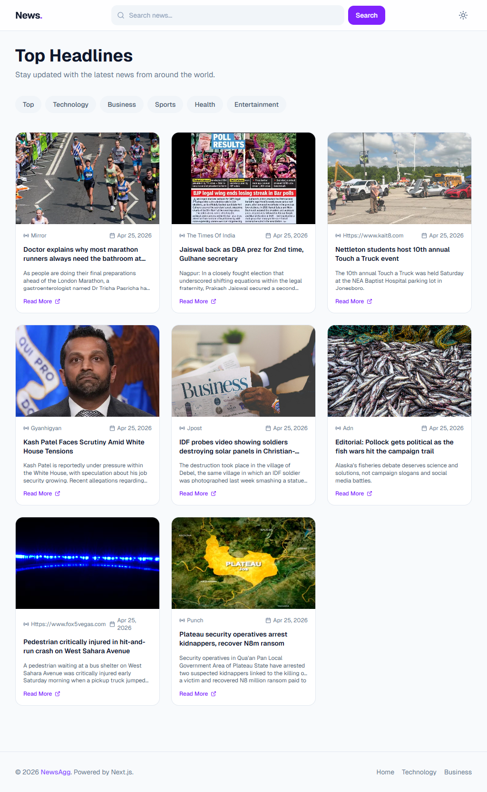
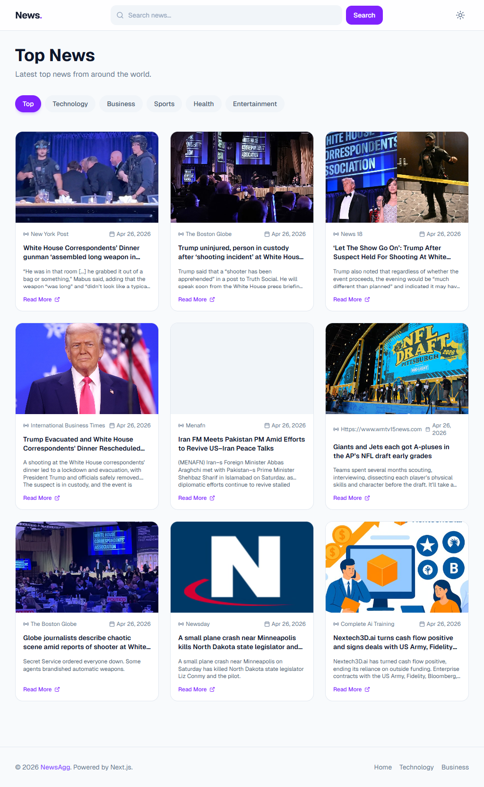
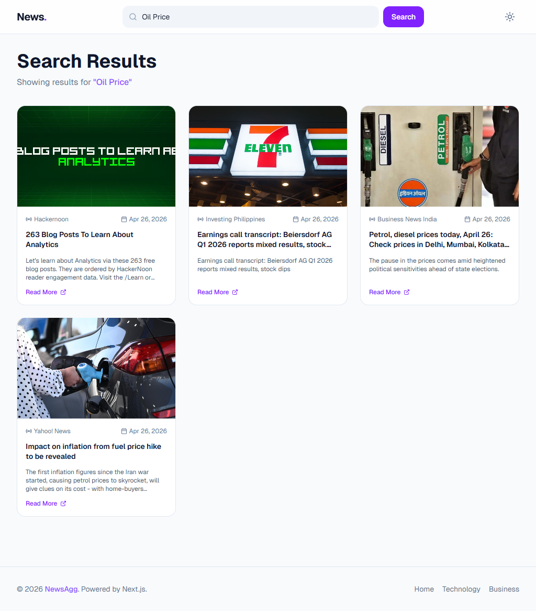
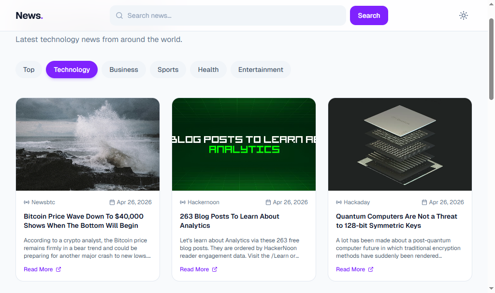

# 📰 News Aggregator

A modern news aggregation app built with Next.js 16 and React 19, powered by the NewsData.io API.

🔗 **Live Demo:** [news-aggregator-one-delta.vercel.app](https://news-aggregator-one-delta.vercel.app/)

---

## ✨ Features

### 🔍 Search & Discovery

- Full-text news search with instant results
- Browse top headlines on home page
- Category-based filtering (Technology, Business, Sports, Health, Entertainment)
- Search query persistence for seamless navigation
- Empty state messaging for no results
- Advanced filtering with debounced search

### 📑 Content Organization

- Categorized news feeds with dedicated pages
- Dynamic routing for category pages
- Clean URL structure with slugs
- Separate search results view
- Category count indicators
- Real-time news updates

### 📰 Article Display

- High-quality article cards with thumbnail images
- Article title, description, and source information
- Publication date with relative time formatting (e.g., "2 hours ago")
- Source attribution and credibility indicators
- Direct links to full articles
- Image fallback for missing thumbnails
- Hover effects for better UX

### 🎯 Category Filtering

- Predefined categories: Technology, Business, Sports, Health, Entertainment
- "Top" category for headline news
- Quick category switching with visual indicators
- Active category highlighting
- Category-based pagination support
- Persistent category selection across sessions

### 🌐 Navigation & Routing

- Home page (/) - browse top headlines
- Category pages (/category/[slug]) - filtered news by category
- Search page (/search) - full-text search results
- Dynamic route handling with Next.js App Router
- Responsive navigation header with category links
- Footer with navigation and information
- Auto scroll to top on navigation

### ⚡ Loading States & Performance

- Skeleton loaders for article cards during initial load
- Smooth loading transitions
- Optimized image loading with next/image
- Server-side caching with 1-hour revalidation (ISR)
- Duplicate article filtering for clean results
- Efficient component rendering

### 📱 Responsive Design

- Mobile-first approach with Tailwind CSS
- 1-column layout on mobile devices
- 2-column grid on tablets
- 3-column grid on desktop
- Responsive font sizing and spacing
- Optimized touch targets for mobile
- Flexible navigation on smaller screens

### 🛡️ Error Handling & Reliability

- Route-level error boundaries
- User-friendly error messages
- 404 page for invalid routes
- Graceful API error handling
- Fallback images for missing article thumbnails
- Input validation for search queries
- Retry logic for failed API requests

### ♿ Accessibility

- Semantic HTML (header, nav, main, article, footer)
- Proper heading hierarchy
- ARIA labels where needed
- Keyboard navigation support
- Skip-to-content links
- Screen reader friendly article cards
- Alt text for all images

---

## 🛠️ Built With

- **Next.js 16.2.4** — React framework with App Router and Server Components
- **React 19.2.4** — UI library with latest hooks
- **Tailwind CSS 4** — Utility-first CSS framework for responsive design
- **Lucide React** — Beautiful icon library
- **date-fns 4.1.0** — Date utility library for formatting publication dates
- **NewsData.io API** — Real-time news and article data
- **TypeScript** — Type-safe development
- **ESLint** — Code quality and consistency

---

## 📁 Project Structure

<details>
<summary><strong>Click to expand</strong></summary>

```plaintext
app/
├── category/
│   └── [slug]/
│       └── page.tsx          # Category-specific news page
├── search/
│   └── page.tsx              # Search results page
├── layout.tsx                # Root layout with theme provider
├── page.tsx                  # Home page - top headlines
├── globals.css               # Global styles
├── loading.tsx               # Global loading state
└── not-found.tsx             # 404 page

components/
├── layout/
│   ├── Footer.tsx            # Footer with links and info
│   ├── Header.tsx            # Navigation header with search
│   └── ThemeProvider.tsx      # Theme context provider
└── ui/
    ├── CategoryFilter.tsx     # Category selection component
    ├── EmptyState.tsx         # No results message
    ├── ErrorState.tsx         # Error message display
    ├── NewsCard.tsx           # Individual article card
    ├── NewsGrid.tsx           # Grid layout for articles
    ├── SearchBar.tsx          # Search input component
    ├── SkeletonCard.tsx        # Loading skeleton
    └── SkeletonGrid.tsx        # Skeleton grid layout

lib/
└── news.ts                   # NewsData.io API integration

public/                        # Static assets
```

</details>

---

## 🚀 Getting Started

### Prerequisites

- Node.js 18+
- NewsData.io API key ([get one here](https://newsdata.io/register))

### Installation

```bash
# Clone the repository
git clone https://github.com/yourusername/news-aggregator

# Navigate to the project folder
cd news-aggregator

# Install dependencies
npm install

# Create a .env.local file
echo NEXT_PUBLIC_API_KEY=your_api_key_here > .env.local

# Start the development server
npm run dev
```

### Build for production

```bash
npm run build
```

### Start production server

```bash
npm start
```

---

## 🔧 Available Scripts

- `npm run dev` — Start Next.js development server (http://localhost:3000)
- `npm run build` — Build for production
- `npm start` — Start production server
- `npm run lint` — Run ESLint code quality check

---

## 🔑 Environment Variables

Create a `.env.local` file in the project root with:

```env
NEXT_PUBLIC_API_KEY=your_newsdata_io_api_key
```

Obtain your free API key from [NewsData.io](https://newsdata.io/register)

---

## 🧠 Key Concepts & Architecture

- **Next.js App Router** — Modern routing with Server and Client Components
- **Server-Side Rendering (SSR)** — Fast initial page loads with pre-rendered content
- **Incremental Static Regeneration (ISR)** — 1-hour cache revalidation for fresh content
- **Dynamic Routes** — Category pages generated from slugs
- **API Integration** — Centralized NewsData.io API calls in `lib/news.ts`
- **Component Architecture** — Reusable UI and layout components
- **Type Safety** — Full TypeScript support for robust code
- **Responsive Design** — Mobile-first Tailwind CSS approach
- **Duplicate Filtering** — Smart deduplication by article title
- **Image Optimization** — Automatic image handling and fallbacks
- **Date Formatting** — Human-readable relative dates with date-fns
- **Error Boundaries** — Route-level error handling for reliability

---

## 📸 Screenshots

### Home Page — Top Headlines & Category Navigation

Browse the latest top headlines with easy category switching

<br/><br/>

### Category Page — Filtered News Feed

View all news articles for a specific category with consistent layout

<br/><br/>

### Search Results — Full-Text Search

Find news articles by searching keywords with paginated results

<br/><br/>

### Article Cards — Rich Preview

Each article displays title, description, thumbnail, source, and publication time


---

## 📝 License

MIT License

_Built as a portfolio project to showcase Next.js, React, API integration, and responsive UI design._
